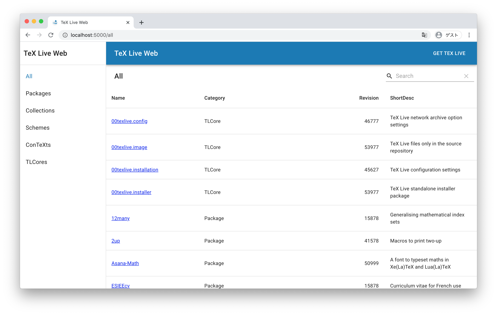

# TeX Live Web


This is a web-based TeX Live package (texlive.tlpdb) browser.
This project is greatly inspired by msys2-web (https://github.com/msys2/msys2-web).


## TRY THIS REPO
To try this repo do following steps.

1. Clone this repo:
```
git clone https://github.com/tsuu32/texlive-web.git
cd texlive-web
```

2. Download texlive.tlpdb:
```
wget http://mirrors.ctan.org/systems/texlive/tlnet/tlpkg/texlive.tlpdb
```

3. Build server:
```
go build
```

4. Build client:
```
cd client
yarn install
yarn build
cd ..
```

5. Run sever:
```
./texlive-web
```

Visit localhost:5000 and enjoy texlive-web!


## USEFUL LINKS
* https://medium.com/@synapticsynergy/serving-a-react-app-with-golang-using-gin-c6402ee64a4b
  * gin + react

* https://melpa.org/
  * another package browser that this project is inspired by
